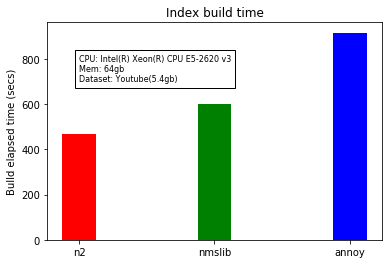
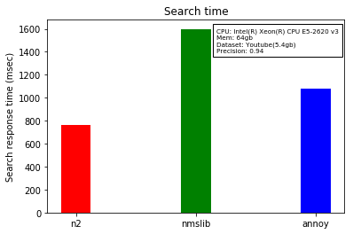

N2
== 

.. image:: https://travis-ci.org/kakao/n2.svg?branch=master
   :target: https://travis-ci.org/kakao/n2

.. image:: https://img.shields.io/pypi/v/n2.svg?style=flat
   :target: https://pypi.python.org/pypi/n2
   
N2 - approximate **N**\ earest **N**\ eighbor

.. code:: python

    import numpy as np
    from n2 import HnswIndex

    N, dim = 10240, 20
    samples = np.arange(N * dim).reshape(N, dim)

    index = HnswIndex(dim)
    for sample in samples:
        index.add_data(sample)
    index.build(m=5, n_threads=4)
    print(index.search_by_id(0, 10))
    # [0, 1, 2, 3, 4, 5, 6, 7, 8, 9]

Install
-------

To install:

.. code:: bash

    sudo pip install n2

For more detail, see `the installation`_ for instruction on how to build N2 from source.

Introduce
---------

N2 is an approximate nearest neighborhoods algorithm library written in
C++ (including Python/Go bindings). N2 provides a much faster search
speed than other implementations when modeling large dataset. Also, N2
supports multi-core CPUs for index building.

Background
----------

There are great approximate nearest neighborhoods libraries such as
`annoy`_ and `nmslib`_, but they did not fully meet the requirments to
handle Kakao’s dataset. Therefore, we decided to implement a library
that improves usability and performs better based on `nmslib`_. And
finally, we release N2 to the world.

Features
--------

-  Efficient implementations. N2 is a lightweight library which runs faster even with large datasets.
-  Support multi-core CPUs for index building.
-  Support a mmap feature by default for handling large index files
   efficiently.
-  Support Python/Go bindings.

Performance
-----------

If you want to read about detail benchmark explanation. See `the
benchmark`_ for more experiments.

Index build times
~~~~~~~~~~~~~~~~~

|image0|

Search speed
~~~~~~~~~~~~

|image1|

Memory usage
~~~~~~~~~~~~

|image2|

.. install-1:

Bindings
--------

The following guides explain how to use N2 with basic examples and API.

-  `Python`_
-  `C++`_
-  `Go`_

References
----------

-  “Efficient and robust approximate nearest neighbor search using
   Hierarchical Navigable Small World graphs” by Yu. A. Malkov, D. A.
   Yashunin (available on arxiv: http://arxiv.org/abs/1603.09320)
-  nmslib: https://github.com/searchivarius/NMSLIB
-  annoy: https://github.com/spotify/annoy

License
-------

This software is licensed under the `Apache 2 license`_, quoted below.

Copyright 2017 Kakao Corp. http://www.kakaocorp.com

Licensed under the Apache License, Version 2.0 (the “License”); you may
not use this project except in compliance with the License. You may
obtain a copy of the License at
http://www.apache.org/licenses/LICENSE-2.0.

Unless required by applicable law or agreed to in writing, software
distributed under the License is distributed on an “AS IS” BASIS,
WITHOUT WARRANTIES OR CONDITIONS OF ANY KIND, either express or implied.
See the License for the specific language governing permissions and
limitations under the License.

.. _annoy: https://github.com/spotify/annoy
.. _nmslib: https://github.com/searchivarius/nmslib
.. _the benchmark: docs/benchmark.rst
.. _the installation: INSTALL.rst
.. _Python: docs/Python_API.rst
.. _C++: docs/Cpp_API.rst
.. _Go: docs/Go_API.rst
.. _Apache 2 license: LICENSE.txt

.. |image2| image:: docs/imgs/mem/memory_usage.png
