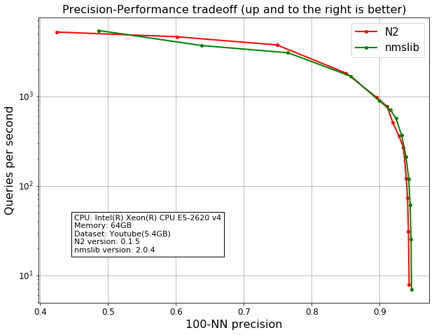

N2 Benchmark explanation
========================

Benchmark Focus
---------------

First, the new approximate nearest neighborhoods algorithm should run
faster for large datasets. Second, online content services like news
portal, where dataset is frequently updated(e.g. create/update/delete),
building the index file should be done in minimum time. Therefore, these
are our main criteria:

-  How long does it take to build the index file?
-  How long does it take to get results from the large dataset?
-  How large memory does it take to run large dataset?

Test dataset
------------

Dataset description
~~~~~~~~~~~~~~~~~~~

To test large amounts of data, we use ``youtube`` dataset that 
contains 14520986 samples, each sample has 40 data points.

+-------------------+-------------------+----+-------------------+--------------------+
| feature1(float32) | feature2(float32) | …… | feature2(float32) | feature40(float32) |
+===================+===================+====+===================+====================+
|     -0.167898     |     0.160478      | …… |    0.104421       |    0.0503584       |
+-------------------+-------------------+----+-------------------+--------------------+

How to get it
~~~~~~~~~~~~~

For benchmark, you can download it using our script. see `Download dataset`_.

We also share ``youtube`` dataset through `google
drive <https://drive.google.com/open?id=1B3PWRTb8xol9fEkawVbpfitOsuwXkqss>`__.
It consists of two plain text files, ``youtube.txt`` and ``youtube.txt.vids``.
``youtube.txt`` contains samples, ``youtube.txt.vids`` is a metadata informations of the dataset. Each
line is the metadata corresponding to each sample of ``youtube.txt``.

+------------------+-------------+-------------------------------------------+
|       DSID       |     VID     |              Youtube link                 |
+==================+=============+===========================================+
|34XnPr4YKpo8wE_mEl| Z1Jilm0TZHY | http://www.youtube.com/watch?v=Z1Jilm0TZHY|
+------------------+-------------+-------------------------------------------+

Test Environment
----------------

- CPU: Intel(R) Xeon(R) CPU E5-2620 v4
- Memory: 64GB
- Storage: HDD
- Dataset: Youtube(5.4GB)
- N2 version: 0.1.5
- nmslib version: 2.0.4
- g++(gcc) 7.3.1

Index build times
-----------------

|image0|

+----------------+-------------+-------------+-------------+-------------+------------+
| Library        | 1 thread    | 2 threads   | 4 threads   | 8 threads   | 16 threads |
+================+=============+=============+=============+=============+============+
| N2 (3.7GB)     | 4628.62 sec | 2625.57 sec | 1456.18 sec | 844.54 sec  | 538.68 sec |
+----------------+-------------+-------------+-------------+-------------+------------+
| nmslib (3.9GB) | 6368.85 sec | 3865.73 sec | 2081.81 sec | 1092.89 sec | 666.20 sec |
+----------------+-------------+-------------+-------------+-------------+------------+

The above data shows a comparison of index build times with thread changes. 
N2 is 19~27% faster than the nmslib to build index file. 

Search speed
------------

|image1|

+-----------------------------------------+-----------------+----------+
| Library                                 | search time     | accuracy |
+=========================================+=================+==========+
| N2 (efCon = 100, efSearch = 25)         | 0.000191692853  | 0.424057 |
+-----------------------------------------+-----------------+----------+
| N2 (efCon = 100, efSearch = 50)         | 0.0002163668156 | 0.601179 |
+-----------------------------------------+-----------------+----------+
| N2 (efCon = 100, efSearch = 100)        | 0.0002673476934 | 0.748796 |
+-----------------------------------------+-----------------+----------+
| N2 (efCon = 100, efSearch = 250)        | 0.0005520210505 | 0.850445 |
+-----------------------------------------+-----------------+----------+
| N2 (efCon = 100, efSearch = 500)        | 0.001028939319  | 0.895242 |
+-----------------------------------------+-----------------+----------+
| N2 (efCon = 100, efSearch = 750)        | 0.001303373504  | 0.910901 |
+-----------------------------------------+-----------------+----------+
| N2 (efCon = 100, efSearch = 1000)       | 0.001953691959  | 0.919208 |
+-----------------------------------------+-----------------+----------+
| N2 (efCon = 100, efSearch = 1500)       | 0.002749215031  | 0.928018 |
+-----------------------------------------+-----------------+----------+
| N2 (efCon = 100, efSearch = 2500)       | 0.003751451612  | 0.934984 |
+-----------------------------------------+-----------------+----------+
| N2 (efCon = 100, efSearch = 5000)       | 0.008200209832  | 0.939109 |
+-----------------------------------------+-----------------+----------+
| N2 (efCon = 100, efSearch = 10000)      | 0.01378832684   | 0.941021 |
+-----------------------------------------+-----------------+----------+
| N2 (efCon = 100, efSearch = 25000)      | 0.03242799292   | 0.942262 |
+-----------------------------------------+-----------------+----------+
| N2 (efCon = 100, efSearch = 100000)     | 0.1272339942    | 0.943302 |
+-----------------------------------------+-----------------+----------+
| nmslib (efCon = 100, efSearch = 25)     | 0.0001844111204 | 0.486474 |
+-----------------------------------------+-----------------+----------+
| nmslib (efCon = 100, efSearch = 50)     | 0.0002713298321 | 0.637868 |
+-----------------------------------------+-----------------+----------+
| nmslib (efCon = 100, efSearch = 100)    | 0.0003269775152 | 0.764977 |
+-----------------------------------------+-----------------+----------+
| nmslib (efCon = 100, efSearch = 250)    | 0.0005977529526 | 0.857598 |
+-----------------------------------------+-----------------+----------+
| nmslib (efCon = 100, efSearch = 500)    | 0.001127228618  | 0.899621 |
+-----------------------------------------+-----------------+----------+
| nmslib (efCon = 100, efSearch = 750)    | 0.00142812109   | 0.915815 |
+-----------------------------------------+-----------------+----------+
| nmslib (efCon = 100, efSearch = 1000)   | 0.001758913255  | 0.923814 |
+-----------------------------------------+-----------------+----------+
| nmslib (efCon = 100, efSearch = 1500)   | 0.002715426302  | 0.932147 |
+-----------------------------------------+-----------------+----------+
| nmslib (efCon = 100, efSearch = 2500)   | 0.004713194823  | 0.938547 |
+-----------------------------------------+-----------------+----------+
| nmslib (efCon = 100, efSearch = 5000)   | 0.008359930491  | 0.942717 |
+-----------------------------------------+-----------------+----------+
| nmslib (efCon = 100, efSearch = 10000)  | 0.01632316473   | 0.944737 |
+-----------------------------------------+-----------------+----------+
| nmslib (efCon = 100, efSearch = 25000)  | 0.03980695992   | 0.946092 |
+-----------------------------------------+-----------------+----------+
| nmslib (efCon = 100, efSearch = 100000) | 0.144999783     | 0.946819 |
+-----------------------------------------+-----------------+----------+

The above data shows QPS(Queries Per Second) values according to accuracy change. N2 and nmslib both libraries have similar search performance.

Memory usage
------------

|image2|

+-----------+----------------+
|  Library  |  memory usage  |
+===========+================+
| N2        | 11209.5 MB     |
+-----------+----------------+
| nmslib    | 13006.2 MB     |
+-----------+----------------+

The above data shows the difference in memory usage before and after index file build.
N2 uses 14% less memory than nmslib.

Conclusion
----------

N2 builds index file faster and uses less memory than nmslib, but has similar search performance.

The benchmark environment uses multiple threads for index builds but a single thread for searching.
In a real production environment, you will need concurrent searches (by multiple processes or multiple threads).
N2 allows you to search simultaneously using multiple processes. With mmap support in N2, It works much more efficiently than other libraries, including the nmslib.

.. _Download dataset: ../benchmarks/README.md#1-download-dataset

.. |image0| image:: imgs/build_time/build_time_threads.png

.. |image2| image:: imgs/mem/memory_usage.png
